# security-forecasting-research
Graduate Research and Thesis around Security Forecasting

Summary:
Hi Everyone! I'm working on completing my masters and to do that I'm soliciting my security friends to help with their participation. My thesis is around analyzing data on the variance of how we all forecast security events and the confidence we have in our forecast. I'll be asking friends that work in both infosec and technology to participate. 

If you've never participated in forecasting before, this is a great video to watch: https://www.youtube.com/watch?v=0TNCYVrm8aM

As far as the ask and the methodology.
Once a week I will release 1 new question to forecast to 100+ friends. 

## Questions

### Question for Monday, June 1st (participants either received question A or question B but not both)

The goal of these questions was to determine if there was any variance between security participants as well as variance compared to technical participants. 

For these questions two things were asked. 1) a specific numerical forecast and 2) an interval e.g. x-y that allowed the participant to choose an interval range where they felt 70% confident the correct answer would be.

Question A:
By the end of 2020, How many Cybersecurity Series A investment deals will there be?

Variance of Forecasted Answers (Security Practitioners):

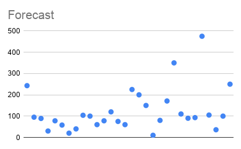

Variance of Forecasted Answers (Technical Practitioners):

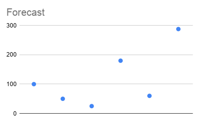

Variance of Interval Size (w/ 70% Confidence) (Security Practitioners):

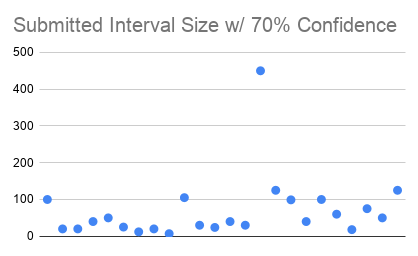

Variance of Interval Size (w/ 70% Confidence) (Technical Practitioners):

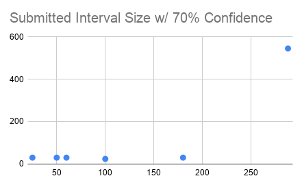

Question B:
By the end of 2020, What will be the largest public single payout by a Bug Bounty Program?

Variance of Forecasted Answers (Security Practitioners):

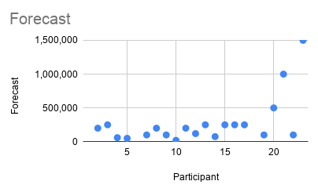

Variance of Forecasted Answers (Technical Practitioners):

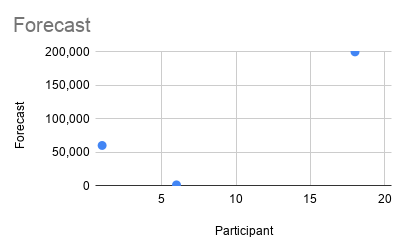

Variance of Interval Size (w/ 70% Confidence) (Security Practitioners):

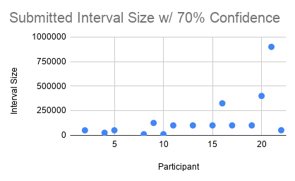

Variance of Interval Size (w/ 70% Confidence) (Technical Practitioners):

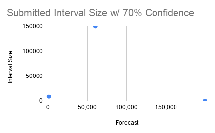

### Question for Monday, May 25th (participants either received question A or question B but not both)

Question A:
In the next 12 months, which of the Fortune 100 companies will have a new public data breach mentioned in the New York Times first? (Note: Refer to the Fortune 100 list as of May 25th, 2020) (2nd Note: Digital or Print Edition)?

Variance of Forecasted Answers:

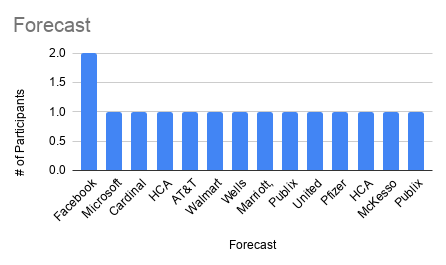

Variance of Confidence:

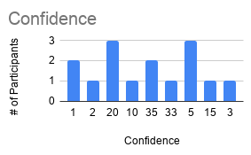

Question B:
For the future date of January 1st, 2021, what will be the largest number of individuals notified by a single company/entity documented in the Department of Health and Human Services (HHS) breach portal?

Variance of Forecasted Answers:

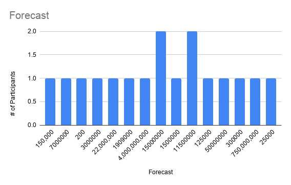

Variance of Confidence:

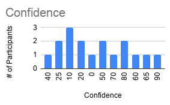

===

### Question for Monday, May 18th (participants either received question A or question B but not both)

Question A:
How many unique CVEs will be in the June 2020 Google Android Operating System public security bulletin?

Variance of Forecasted Answers:

Variance of Confidence:

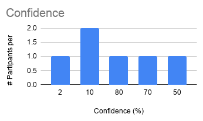

Question B:
What will the average enterprise ransomware payment be in Q3 of 2020?

Variance of Forecasted Answers:

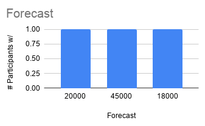

Variance of Confidence:

